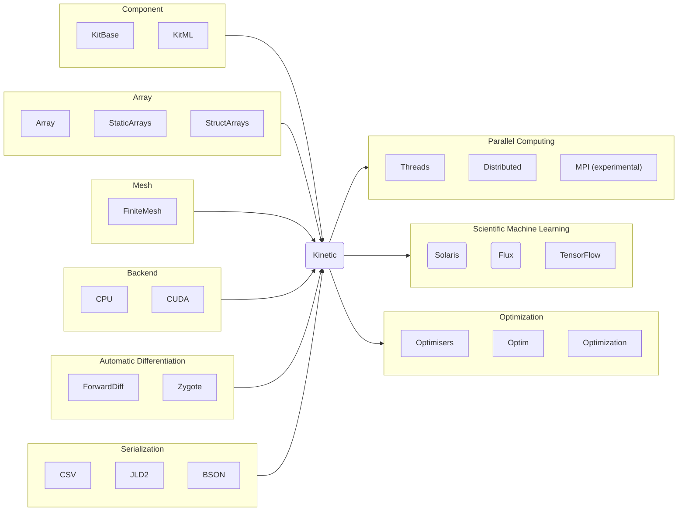

<div align="center">
  <h1>Kinetic</h1>
  
  </img>
  
  [](https://juliahub.com/ui/Packages/Kinetic/wrVmu)
  
  [](https://xiaotianbai.com/Kinetic.jl/dev/)
  [](https://xiaotianbai.com/Kinetic.jl/stable/)
  [](https://joss.theoj.org/papers/65d56efef938caf92c2cc942d2c25ea4)
  [](https://juliapkgstats.com/pkg/KitBase)
<!--[](https://pkgs.genieframework.com?packages=Kinetic)
[](https://pkgs.genieframework.com?packages=Kinetic)-->

 <!--
| [Kinetic](https://github.com/vavrines/Kinetic.jl) | [KitBase](https://github.com/vavrines/KitBase.jl) | [KitML](https://github.com/vavrines/KitML.jl) | [KitFort](https://github.com/vavrines/KitFort.jl) |
| ---------- | --------- | ---------------- | ------ |
|  |  |  |  |
| [](https://codecov.io/gh/vavrines/Kinetic.jl) | [](https://codecov.io/gh/vavrines/KitBase.jl) | [](https://codecov.io/gh/vavrines/KitML.jl) | [](https://codecov.io/gh/vavrines/KitFort.jl) |
 |  |  | 
-->
</div>

<!--


[](https://github.com/SciML/ColPrac)
[](https://github.com/vavrines/Kinetic.jl)
[](https://badges.pufler.dev)
-->

<!--<div align="center"> </img>
</div>-->
<!--
# Kinetic.jl

-->

**Kinetic** is a computational fluid dynamics toolbox written in <a href="https://julialang.org">Julia.</a>
It aims to furnish efficient modeling and simulation methodologies for collective transport of particles, augmented by the power of machine learning.
Based on differentiable programming, mechanical and neural network models are fused and solved in a unified framework.
Simultaneous 1-3 dimensional numerical simulations can be performed on CPUs and GPUs.

The ecosystem follows the modular design philosophy.
Depending on the specific use case, the main module is split into portable components to reduce the lantency caused by the LLVM [just-in-time](https://llvm.org/docs/tutorial/index.html#building-a-jit-in-llvm) compiler:

- [KitBase](https://github.com/vavrines/KitBase.jl): physical models and numerical schemes
- [KitML](https://github.com/vavrines/KitML.jl): neural models and machine learning methods
- [KitFort](https://github.com/vavrines/KitFort.jl): optional high-performance Fortran backend
- [FluxReconstruction](https://github.com/vavrines/FluxReconstruction.jl): high-fidelity solution algorithms
- [Langevin](https://github.com/vavrines/Langevin.jl): intrusive uncertainty quantification methods
- [KitAMR](https://github.com/CFDML/KitAMR.jl): large-scale distributed computing facilities
- [kineticpy](https://github.com/vavrines/kineticpy): Python interface built on top of [pyjulia](https://github.com/JuliaPy/pyjulia)

## Installation

Kinetic is a registered package in the official [Julia package registry](https://github.com/JuliaRegistries/General).
We recommend installing it with the Julia package manager. 
From the Julia REPL, you can get in the package manager (by pressing `]`) and add the package

```julia
julia> ]
(v1.11) pkg> add Kinetic
```
This will automatically install a currently stable release and all its dependencies.

## Physics

Kinetic models and simulates fluid dynamics problems from the perspective of particle transport.
Any advection-diffusion-type equation of different particles, including molecules, photons, plasmas, neutrons, etc., can be solved within the framework.
Special attentions have been paid on Hilbert's sixth problem, i.e. to build the numerical passage between kinetic theory of gases, e.g. the Boltzmann equation, and continuum mechanics, e.g. the Euler and Navier-Stokes equations.
A partial list of current supported models and equations include:
- Boltzmann equation
- radiative transfer equation
- Fokker-Planck-Landau equation
- direct simulation Monte Carlo
- advection-diffusion equation
- Burgers equation
- Euler equations
- Navier-Stokes equations
- Magnetohydrodynamical equations
- Maxwell's equations

## Structure

The structure of Kinetic is shown in the schematic below:



## Documentation

For the detailed implementation and usage of the package, please
check the documentation:

- [**STABLE**](https://xiaotianbai.com/Kinetic.jl/stable/): latest tagged version of the package
- [**LATEST**](https://xiaotianbai.com/Kinetic.jl/dev/): in-development version of the package

## Citing

If you benefit from Kinetic in your research, teaching, or otherwise, we would be happy if you could mention or cite it:

```
@article{xiao2021kinetic,
  doi = {10.21105/joss.03060},
  url = {https://doi.org/10.21105/joss.03060},
  year = {2021},
  publisher = {The Open Journal},
  volume = {6},
  number = {62},
  pages = {3060},
  author = {Tianbai Xiao},
  title = {Kinetic.jl: A portable finite volume toolbox for scientific and neural computing},
  journal = {Journal of Open Source Software}
}
```

## Contributing

Feel free to dive in! If you have any questions or ideas, please [open an issue](https://github.com/vavrines/Kinetic.jl/issues/new) or submit pull requests.
If you're new to the open source community and looking for a cool little project to work on that fits your interests, we're happy to help along the way.

## License

[MIT](LICENSE) © Tianbai Xiao
