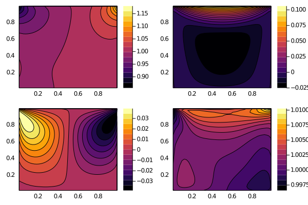

# Lid-driven cavity

We then show the lid-driven cavity.
It's a four dimensional problem, with two in physical domain ``(x,y)`` and another in particle velocity domain ``(u,v)``.
Similarly, we prepare the configuration file as
```
# setup
matter = gas
case = cavity
space = 2d2f2v
flux = kfvs
collision = bgk
nSpecies = 1
interpOrder = 2
limiter = vanleer
boundary = maxwell
cfl = 0.8
maxTime = 5.0

# phase space
x0 = 0.0
x1 = 1.0
nx = 45
y0 = 0.0
y1 = 1.0
ny = 45
pMeshType = uniform
nxg = 0
nyg = 0

# velocity space
umin = -5.0
umax = 5.0
nu = 28
vmin = -5.0
vmax = 5.0
nv = 28
vMeshType = rectangle
nug = 0
nvg = 0

# gas
knudsen = 0.075
mach = 0.0
prandtl = 1.0
inK = 1.0
omega = 0.72
alphaRef = 1.0
omegaRef = 0.5

# boundary
uLid = 0.15
vLid = 0.0
tLid = 1.0
```

We then execute the following codes to conduct a simulation
```julia
using Kinetic
set, ctr, a1face, a2face, t = initialize("config.txt")
t = solve!(set, ctr, a1face, a2face, t)
```

The high-level solver `solve!` is equivalent as the following low-level procedures
```julia
using ProgressMeter
res = zeros(4)
dt = timestep(ks, ctr, t)
nt = floor(ks.set.maxTime / dt) |> Int
@showprogress for iter = 1:nt
    reconstruct!(ks, ctr)
    evolve!(ks, ctr, a1face, a2face, dt; mode = Symbol(ks.set.flux), bc = Symbol(ks.set.boundary))
    update!(ks, ctr, a1face, a2face, dt, res; coll = Symbol(ks.set.collision), bc = Symbol(ks.set.boundary))
end
```

It can be further expanded into the lower-level backend.
```julia
# lower-level backend 
@showprogress for iter = 1:nt
    # horizontal flux
    @inbounds Threads.@threads for j = 1:ks.pSpace.ny
        for i = 2:ks.pSpace.nx
            KitBase.flux_kfvs!(
                a1face[i, j].fw,
                a1face[i, j].fh,
                a1face[i, j].fb,
                ctr[i-1, j].h,
                ctr[i-1, j].b,
                ctr[i, j].h,
                ctr[i, j].b,
                ks.vSpace.u,
                ks.vSpace.v,
                ks.vSpace.weights,
                dt,
                a1face[i, j].len,
            )
        end
    end
    
    # vertical flux
    vn = ks.vSpace.v
    vt = -ks.vSpace.u
    @inbounds Threads.@threads for j = 2:ks.pSpace.ny
        for i = 1:ks.pSpace.nx
            KitBase.flux_kfvs!(
                a2face[i, j].fw,
                a2face[i, j].fh,
                a2face[i, j].fb,
                ctr[i, j-1].h,
                ctr[i, j-1].b,
                ctr[i, j].h,
                ctr[i, j].b,
                vn,
                vt,
                ks.vSpace.weights,
                dt,
                a2face[i, j].len,
            )
            a2face[i, j].fw .= KitBase.global_frame(a2face[i, j].fw, 0., 1.)
        end
    end
    
    # boundary flux
    @inbounds Threads.@threads for j = 1:ks.pSpace.ny
        KitBase.flux_boundary_maxwell!(
            a1face[1, j].fw,
            a1face[1, j].fh,
            a1face[1, j].fb,
            ks.ib.bcL,
            ctr[1, j].h,
            ctr[1, j].b,
            ks.vSpace.u,
            ks.vSpace.v,
            ks.vSpace.weights,
            ks.gas.K,
            dt,
            ctr[1, j].dy,
            1.,
        )

        KitBase.flux_boundary_maxwell!(
            a1face[ks.pSpace.nx+1, j].fw,
            a1face[ks.pSpace.nx+1, j].fh,
            a1face[ks.pSpace.nx+1, j].fb,
            ks.ib.bcR,
            ctr[ks.pSpace.nx, j].h,
            ctr[ks.pSpace.nx, j].b,
            ks.vSpace.u,
            ks.vSpace.v,
            ks.vSpace.weights,
            ks.gas.K,
            dt,
            ctr[ks.pSpace.nx, j].dy,
            -1.,
        )
    end
    
    @inbounds Threads.@threads for i = 1:ks.pSpace.nx
        KitBase.flux_boundary_maxwell!(
            a2face[i, 1].fw,
            a2face[i, 1].fh,
            a2face[i, 1].fb,
            ks.ib.bcD,
            ctr[i, 1].h,
            ctr[i, 1].b,
            vn,
            vt,
            ks.vSpace.weights,
            ks.gas.K,
            dt,
            ctr[i, 1].dx,
            1,
        )
        a2face[i, 1].fw .= KitBase.global_frame(a2face[i, 1].fw, 0., 1.)
        
        KitBase.flux_boundary_maxwell!(
            a2face[i, ks.pSpace.ny+1].fw,
            a2face[i, ks.pSpace.ny+1].fh,
            a2face[i, ks.pSpace.ny+1].fb,
            [1., 0.0, -0.15, 1.0],
            ctr[i, ks.pSpace.ny].h,
            ctr[i, ks.pSpace.ny].b,
            vn,
            vt,
            ks.vSpace.weights,
            ks.gas.K,
            dt,
            ctr[i, ks.pSpace.ny].dy,
            -1,
        )
        a2face[i, ks.pSpace.ny+1].fw .= KitBase.global_frame(
            a2face[i, ks.pSpace.ny+1].fw,
            0.,
            1.,
        )
    end

    # update
    @inbounds for j = 1:ks.pSpace.ny
        for i = 1:ks.pSpace.nx
            KitBase.step!(
                ctr[i, j].w,
                ctr[i, j].prim,
                ctr[i, j].h,
                ctr[i, j].b,
                a1face[i, j].fw,
                a1face[i, j].fh,
                a1face[i, j].fb,
                a1face[i+1, j].fw,
                a1face[i+1, j].fh,
                a1face[i+1, j].fb,
                a2face[i, j].fw,
                a2face[i, j].fh,
                a2face[i, j].fb,
                a2face[i, j+1].fw,
                a2face[i, j+1].fh,
                a2face[i, j+1].fb,
                ks.vSpace.u,
                ks.vSpace.v,
                ks.vSpace.weights,
                ks.gas.K,
                ks.gas.γ,
                ks.gas.μᵣ,
                ks.gas.ω,
                ks.gas.Pr,
                ctr[i, j].dx * ctr[i, j].dy,
                dt,
                zeros(4),
                zeros(4),
                :bgk,
            )
        end
    end
end
```

The result can be visualized with built-in function `plot_contour`, which presents the contours of gas density, U-velocity, V-velocity and temperature inside the cavity.
```julia
KitBase.plot_contour(ks, ctr)
```



It is equivalent as the following low-level backend.
```julia
begin
    using Plots
    sol = zeros(4, ks.pSpace.nx, ks.pSpace.ny)
    for i in axes(ρ, 1)
        for j in axes(ρ, 2)
            sol[1:3, i, j] .= ctr[i, j].prim[1:3]
            sol[4, i, j] = 1.0 / ctr[i, j].prim[4]
        end
    end
    contourf(ks.pSpace.x[1:ks.pSpace.nx, 1], ks.pSpace.y[1, 1:ks.pSpace.ny], sol[3, :, :]')
end
```
