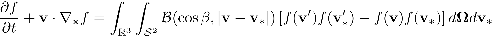
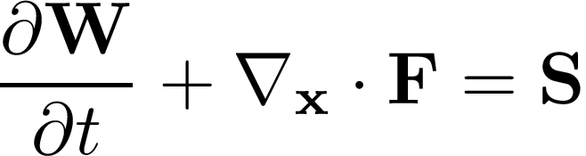

# Summary

``Kinetic.jl`` is a lightweight toolbox for computational fluid dynamics and scientific machine learning. It focus on the theoretical and numerical studies of many-particle systems of gases, photons, plasmas, neutrons, etc. Under the hood, the finite volume method (FVM) is implemented with various flux functions and update algorithms. Therefore, 1-3 dimensional numerical simulations can be conducted for any advection-diffusion type equations. Special attentions have been paid on Hilbert's sixth problem, i.e. to build the numerical passage between kinetic theory of gases, e.g. the Boltzmann equation



and the Navier-Stokes equations.



``Kinetic.jl`` is an open-source project hosted on GitHub and distributed under MIT license. The main module consists of ``KitBase.jl`` with basic physics and ``KitML.jl`` with neural dynamics. The high-performance Fortran library ``KitFort.jl`` is not included by default, but can be manually imported when the executing efficiency becomes the priority. A Python wrapper ``kineticpy`` has been built as well to locate the structures and methods through ``pyjulia``. It is easy to perform a subtask with the corresponding portable module.

`Kinetic.jl` leverages the Julia programming language [@bezanson2017] for its implementation. The motivation behind it is to balance the flexibility for scientific research, the efficiency for application, and the simplicity for educational usage. Most of the mature FVM libraries, e.g. the OpenFOAM [@jasak2007], are written in compiled languages (C/C++, Fortran), which enjoy the perfect execution efficiency and sacrifice the speed and flexibility for a second development. For example, it is cumbersome to introduce phase-field evolution in OpenFOAM or integrate it with scientific machine learning (SciML) packages. Regarding this situation, the compromise has been made [@clawpack2020], which split the high-level front-ends and the low-level computational back-ends. Usually the front-end is implemented with interpreted languages, e.g. Python, which is able to call the low-level APIs written by compiled languages. Basically it benefits general users, while researchers need to work on the back-end anyhow if a new feature is in desire. Besides, the two-language problem will introduce additional trade-off in development and execution.

Julia programming language is dynamically typed and designed for high performance computing for broad devices. Based on type inference and multiple dispatch, it is an ideal choice to solve the two-language problem. In `Kinetic.jl`, we provide different hierarchies of abstraction. At the highest level, it is feasible to model and simulate a typical gas dynamic problem within 10 lines of code. At the lowest level, we design the methods for general `Number` and `AbstractArray` , so that it holds the perfect possibility to cooperate with existing packages in Julia ecosystem. As an example, `KitML.jl` depends `Flux.jl` [@Flux2018] to conduct scientific machine learning problems.

In the following, we present an illustrative example of the shock tube problem in gas dynamics. With the configuration file `config.txt` set as below,


```
# case
case = sod
space = 1d2f1v
nSpecies = 1
flux = kfvs
collision = bgk
interpOrder = 2
limiter = vanleer
boundary = fix
cfl = 0.5
maxTime = 0.2

# physical space
x0 = 0
x1 = 1
nx = 200
pMeshType = uniform
nxg = 1

# velocity space
vMeshType = rectangle
umin = -5
umax = 5
nu = 28
nug = 0

# gas
knudsen = 0.0001
mach = 0.0
prandtl = 1
inK = 2
omega = 0.81
alphaRef = 1.0
omegaRef = 0.5
```

we execute the following codes

```julia
using Kinetic
set, ctr, face, t = initialize("config.txt")
t = solve!(set, ctr, face, t)
plot_line(set, ctr)
```

The computational setup is stored in `set` and the control volume solutions are stored in `ctr` and `face`. The high-level solver `solve!` is equivalent as the following solution algorithm.

```julia
dt = timestep(ks, ctr, t)
nt = Int(floor(ks.set.maxTime / dt))
res = zeros(3)
for iter = 1:nt
    reconstruct!(ks, ctr)
    evolve!(ks, ctr, face, dt)
    update!(ks, ctr, face, dt, res)
end
```

The result is visualized with built-in function `plot_line`, which presents the profiles of gas density, velocity and temperature inside the tube.


 

The examples of scientific machine learning are introduced systematically in the paper [@xiao2020] .

# Acknowledgements

The current work is funded by the Alexander von Humboldt Foundation

# References